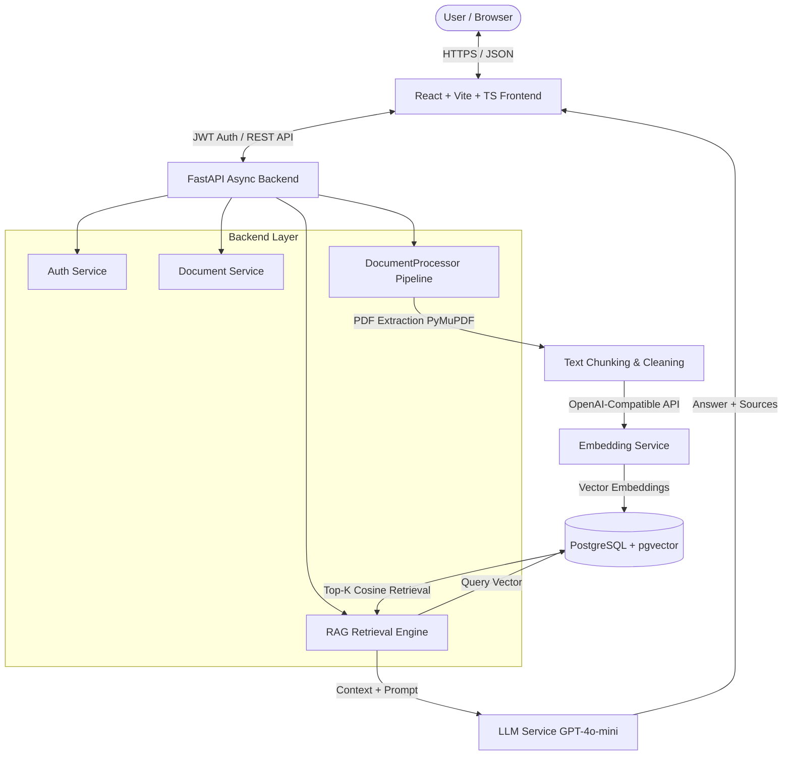

# DocuMind AI 🧠📄

> **Chat with your documents using AI.**

DocuMind AI is a production-quality, full-stack AI-powered Document Q&A application built with **FastAPI**, **React**, **TypeScript**, **PostgreSQL with pgvector**, and **Retrieval-Augmented Generation (RAG)**.

Users can create an account, upload PDF documents, await asynchronous vector ingestion, and ask natural-language questions about their documents. All AI responses are grounded strictly in the uploaded context and include **interactive source citations** (document title, page number, and text excerpt).

---

## 🏗️ System Architecture



---

## 🌟 Key Features

- **JWT Authentication & Authorization**: Secure password hashing with bcrypt, stateless JWT tokens, and strict per-user resource scoping.
- **Async Document Pipeline**: Background PDF text extraction (PyMuPDF), intelligent overlapping chunking, and batch vector embedding.
- **pgvector Vector Database**: Native PostgreSQL cosine similarity search filtered strictly by `user_id` to guarantee user isolation.
- **Strict RAG Answers & Citations**: Direct grounding to prevent hallucinations. Every response provides citation cards with document names, page numbers, and exact text passages.
- **Knowledge Scope Selector**: Choose between searching across "All Documents" or restricting retrieval to a specific PDF.
- **Modern SaaS Dashboard**: Interactive metrics, document library management, conversation history, and user settings.
- **Docker Compose Setup**: One-command deployment including PostgreSQL with pgvector extension, FastAPI backend, and multi-stage Nginx frontend.

---

## 🛠️ Tech Stack

### Frontend
- **Framework**: React 18, Vite, TypeScript
- **Styling**: Tailwind CSS v4, Lucide React Icons
- **Routing & State**: React Router v6, React Context API
- **HTTP Client**: Axios with JWT request interceptors & automatic 401 redirect
- **Markdown & Feedback**: React Markdown, React Hot Toast, React Dropzone

### Backend
- **Framework**: Python 3.12, FastAPI, Pydantic v2
- **Database**: PostgreSQL with `pgvector` extension
- **ORM & Driver**: SQLAlchemy 2.0 (AsyncIO), `asyncpg`
- **Security**: PyJWT, Passlib (bcrypt)
- **PDF Processing**: PyMuPDF (fitz)
- **AI Integration**: Async OpenAI-compatible client for Embeddings (`text-embedding-3-small`) & LLM (`gpt-4o-mini`)

---

## 📁 Project Structure

```
documind-ai/
├── backend/
│   ├── app/
│   │   ├── main.py              # FastAPI app entry point & lifespan
│   │   ├── config.py            # Environment settings & validations
│   │   ├── database.py          # Async SQLAlchemy engine & pgvector init
│   │   ├── models/              # User, Document, DocumentChunk, Conversation, Message
│   │   ├── schemas/             # Pydantic request/response schemas
│   │   ├── routers/             # Auth, Documents, Chat endpoints
│   │   ├── services/            # Auth, Document, Processor, Embedding, LLM, RAG, Chat
│   │   └── dependencies/        # JWT auth dependency
│   ├── uploads/                 # Per-user PDF file storage
│   ├── tests/                   # Pytest async suite
│   ├── requirements.txt         # Python dependencies
│   └── Dockerfile               # Backend container definition
├── frontend/
│   ├── src/
│   │   ├── components/          # UploadModal, SourceCard
│   │   ├── context/             # AuthContext
│   │   ├── layouts/             # AppLayout (Responsive Sidebar & Header)
│   │   ├── pages/               # Landing, Login, Register, Dashboard, Documents, Chat, History, Settings
│   │   ├── services/            # Axios API client
│   │   ├── types/               # TypeScript interfaces
│   │   ├── App.tsx              # App routing & toasts
│   │   └── main.tsx             # Entry point
│   ├── nginx.conf               # Nginx reverse proxy configuration
│   ├── package.json
│   └── Dockerfile               # Multi-stage frontend container
├── docker-compose.yml           # PostgreSQL + pgvector, Backend, Frontend services
├── .env.example                 # Environment template
└── README.md
```

---

## 🚀 Quick Start with Docker

### Prerequisites
- Docker & Docker Compose installed

### 1. Clone & Configure Environment
```bash
cp .env.example .env
```
Edit `.env` and insert your OpenAI API key (or OpenAI-compatible provider key):
```env
LLM_API_KEY=sk-your-actual-api-key
EMBEDDING_API_KEY=sk-your-actual-api-key
```

### 2. Start Services
```bash
docker-compose up --build -d
```

### 3. Access Application
- **Frontend App**: [http://localhost:3000](http://localhost:3000)
- **Backend API Docs**: [http://localhost:8000/api/docs](http://localhost:8000/api/docs)

---

## 💻 Local Development Setup (Without Docker)

### 1. Start PostgreSQL with pgvector
```bash
docker run -d --name pgvector-local \
  -e POSTGRES_USER=documind \
  -e POSTGRES_PASSWORD=documind_secret \
  -e POSTGRES_DB=documind_db \
  -p 5432:5432 \
  pgvector/pgvector:pg16
```

### 2. Backend Setup
```bash
cd backend
python -m venv venv
source venv/bin/activate  # On Windows: venv\Scripts\activate
pip install -r requirements.txt

# Run server
uvicorn app.main:app --reload --port 8000
```

### 3. Frontend Setup
```bash
cd frontend
npm install
npm run dev
```
Open [http://localhost:5173](http://localhost:5173) in your browser.

---

## 🔒 Security & Data Isolation

1. **User Scoping**: Every SQL query for `documents`, `document_chunks`, `conversations`, and vector embeddings filters by `user_id = current_user.id`.
2. **Path Traversal Protection**: Uploaded files use UUID-based safe names stored in user-isolated directories (`uploads/{user_id}/`).
3. **Password Security**: Passwords are hashed using bcrypt before being written to disk.
4. **API Key Safety**: LLM and Embedding API keys are kept strictly on the backend environment layer and are never sent to the client.

---

## 🛣️ Future Architecture Expansion

The project is structured with decoupled service modules to support:
- **Celery + Redis**: Swap `BackgroundTasks` in `document_processor.py` for distributed task queues.
- **Hybrid Vector Search**: Combine BM25 full-text keyword search with pgvector similarity.
- **DOCX / TXT / OCR**: Extend `DocumentProcessor.extract_text()` to parse additional document formats and scanned PDFs.

---

## 📜 License

Distributed under the MIT License. See `LICENSE` for details.
